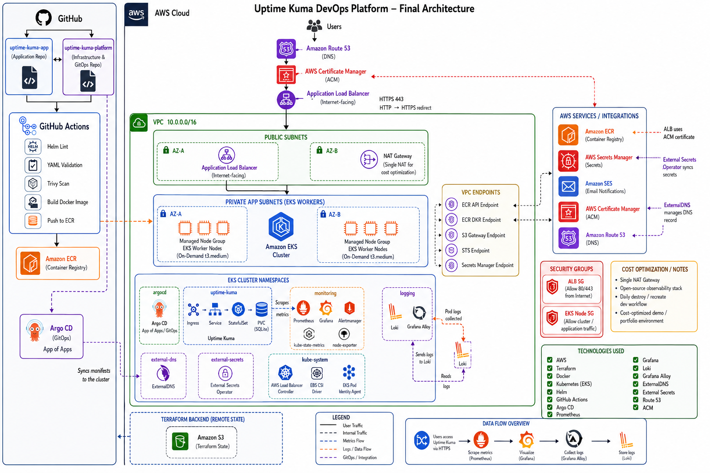

# Uptime Kuma DevOps Platform

A production-inspired DevOps platform for deploying and operating
[Uptime Kuma](https://github.com/louislam/uptime-kuma) on AWS EKS.

This project focuses on the DevOps/platform side of the application:
cloud infrastructure, Kubernetes deployment, GitOps delivery, CI/CD,
HTTPS ingress, DNS automation, secrets management, monitoring, alerting,
and centralized logging.

The platform is designed as a cost-optimized learning and portfolio
environment while still following real-world DevOps practices.

---

## Architecture



---

## Table of Contents

- [Project Goals](#project-goals)
- [High-Level Architecture](#high-level-architecture)
- [Repositories](#repositories)
- [Tech Stack](#tech-stack)
- [Repository Structure](#repository-structure)
- [Infrastructure Layers](#infrastructure-layers)
- [CI/CD Pipeline](#cicd-pipeline)
- [GitOps with Argo CD](#gitops-with-argo-cd)
- [Application Deployment](#application-deployment)
- [DNS and HTTPS](#dns-and-https)
- [Secrets Management](#secrets-management)
- [Observability](#observability)
- [Deployment Guide](#deployment-guide)
- [Verification Guide](#verification-guide)
- [Accessing Services](#accessing-services)
- [Destroy / Cost Control](#destroy--cost-control)
- [Security Considerations](#security-considerations)
- [Known Limitations](#known-limitations)
- [Future Improvements](#future-improvements)
- [Troubleshooting](#troubleshooting)
- [Project Status](#project-status)

---

## Project Goals

The goal of this project is to build a realistic DevOps platform around
an existing application.

Instead of focusing on application development, the project focuses on
the operational platform required to deploy, secure, monitor, and manage
a cloud-native workload.

Main goals:

- Deploy Uptime Kuma on AWS EKS.
- Manage infrastructure with Terraform.
- Use GitOps with Argo CD as the source of truth for Kubernetes workloads.
- Build and push application images with GitHub Actions.
- Store container images in Amazon ECR.
- Expose the application publicly over HTTPS.
- Manage DNS with Route 53 and ExternalDNS.
- Manage secrets outside Git using AWS Secrets Manager and External
  Secrets Operator.
- Add monitoring with Prometheus and Grafana.
- Add alerting with Alertmanager and Amazon SES.
- Add centralized logging with Loki and Grafana Alloy.
- Keep the environment cost-optimized for learning and portfolio use.
- Document the system clearly for interviews and future improvements.

---

## High-Level Architecture

### User Traffic Flow

User traffic enters the platform through the public domain:

```text
Users
  -> Amazon Route 53
  -> AWS Certificate Manager / HTTPS
  -> AWS Application Load Balancer
  -> Kubernetes Ingress
  -> Uptime Kuma Service
  -> Uptime Kuma StatefulSet
  -> PVC-backed application data
```

The application is exposed through an internet-facing AWS Application
Load Balancer. HTTPS is terminated at the ALB using an ACM certificate.
HTTP traffic is redirected to HTTPS.

### CI/CD and GitOps Flow

Application delivery is split between two repositories:

```text
Application repository
  -> GitHub Actions
  -> Docker build
  -> Trivy scan
  -> Push image to Amazon ECR
  -> Update platform/GitOps configuration

Platform repository
  -> Argo CD
  -> EKS cluster
  -> Kubernetes workloads
```

The application repository owns the application source code, Dockerfile,
CI pipeline, and reusable Helm chart.

The platform repository owns Terraform, Argo CD applications,
environment-specific values, Kubernetes manifests, and operational
configuration.

### Observability Flow

```text
Metrics:
Uptime Kuma / Kubernetes components
  -> Prometheus
  -> Grafana dashboards

Logs:
Kubernetes pod logs
  -> Grafana Alloy
  -> Loki
  -> Grafana Explore

Alerts:
Prometheus alert rules
  -> Alertmanager
  -> Amazon SES email notifications
```

---

## Repositories

| Repository | Purpose |
|---|---|
| `uptime-kuma-app` | Application source, Dockerfile, CI workflow, and Helm chart |
| `uptime-kuma-platform` | Terraform, GitOps, Kubernetes manifests, Helm values, and documentation |

Application repository:

```text
https://github.com/ofekpensso/uptime-kuma-app
```

Platform repository:

```text
https://github.com/ofekpensso/uptime-kuma-platform
```

---

## Tech Stack

| Area | Tools |
|---|---|
| Cloud Provider | AWS |
| Infrastructure as Code | Terraform |
| Containerization | Docker |
| Container Registry | Amazon ECR |
| Kubernetes | Amazon EKS |
| Kubernetes Packaging | Helm |
| CI/CD | GitHub Actions |
| GitOps | Argo CD |
| Ingress | AWS Load Balancer Controller / ALB |
| DNS | Amazon Route 53 |
| TLS | AWS Certificate Manager |
| DNS Automation | ExternalDNS |
| Secrets | AWS Secrets Manager / External Secrets Operator |
| Metrics | Prometheus / kube-prometheus-stack |
| Dashboards | Grafana |
| Alerting | Alertmanager |
| Logging | Loki / Grafana Alloy |
| Storage | EBS CSI / Kubernetes PVC |
| Email Notifications | Amazon SES |

---

## Repository Structure

```text
.
├── docs/
│   └── images/
│       └── architecture-diagram.png
├── gitops/
│   ├── applications/
│   ├── bootstrap/
│   ├── manifests/
│   └── values/
├── terraform/
│   ├── backend/
│   ├── cluster-config/
│   │   └── dev/
│   ├── environments/
│   │   └── dev/
│   └── modules/
└── README.md
```

### `docs/`

Contains project documentation assets such as architecture diagrams and
screenshots.

### `gitops/`

Contains the desired Kubernetes state managed by Argo CD.

Main subdirectories:

```text
gitops/
├── bootstrap/
├── applications/
├── manifests/
└── values/
```

- `bootstrap/` contains the root Argo CD application.
- `applications/` contains child Argo CD Application definitions.
- `values/` contains environment-specific Helm values.
- `manifests/` contains Kubernetes manifests not managed through a Helm
  chart.

### `terraform/`

Contains the Infrastructure as Code layers.

Terraform is split into separate layers to make it easier to manage
persistent resources, ephemeral dev infrastructure, and cluster bootstrap
resources independently.

---

## Infrastructure Layers

The platform is divided into three main Terraform layers.

### 1. Terraform Backend Layer

Path:

```text
terraform/backend
```

Purpose:

- Persistent Terraform remote state infrastructure.
- S3 bucket for Terraform state.
- Shared/persistent AWS resources.
- Route 53 hosted zone.
- ACM certificate.
- SES resources.
- Secrets Manager secrets.
- Shared IAM roles used by controllers and integrations.

This layer is considered persistent and should not be destroyed as part
of the daily dev teardown workflow.

### 2. Dev Environment Layer

Path:

```text
terraform/environments/dev
```

Purpose:

- Ephemeral AWS dev infrastructure.
- VPC and networking.
- Public and private subnets.
- NAT Gateway.
- VPC endpoints.
- Amazon EKS cluster.
- Managed node group.
- Amazon ECR repository.
- EKS add-ons.
- Pod Identity associations.
- Security groups.

This layer represents the main runtime environment and can be destroyed
and recreated to control cost.

### 3. Cluster Configuration Layer

Path:

```text
terraform/cluster-config/dev
```

Purpose:

- Kubernetes bootstrap resources.
- StorageClass configuration.
- Argo CD installation.
- Initial/root Argo CD application.
- Cluster-level bootstrap configuration required before GitOps takes
  over workload management.

This layer is applied after the EKS cluster exists.

---

## CI/CD Pipeline

The application repository contains a GitHub Actions workflow that
validates, builds, scans, and publishes the Uptime Kuma image.

Pipeline responsibilities:

- Checkout source code.
- Install application dependencies.
- Run application linting.
- Validate YAML syntax.
- Validate GitHub Actions workflow syntax.
- Run Helm lint and Helm template validation.
- Lint the Dockerfile.
- Authenticate to AWS using GitHub Actions OIDC.
- Login to Amazon ECR.
- Build the Docker image.
- Scan the image with Trivy.
- Push the image to Amazon ECR.
- Publish immutable image tags based on the Git commit SHA.

Image tagging format:

```text
sha-<git-sha>
```

The ECR repository is named:

```text
uptime-kuma
```

The AWS region used by the project is:

```text
us-east-1
```

---

## GitOps with Argo CD

Argo CD is used to continuously reconcile Kubernetes resources from Git
into the EKS cluster.

The platform follows an app-of-apps pattern:

```text
Root Argo CD Application
  -> gitops/applications/*
  -> child applications
  -> Helm charts and raw manifests
```

Git is the source of truth for:

- Platform components.
- Application deployment configuration.
- Monitoring configuration.
- Logging configuration.
- Secrets references.
- Environment-specific Helm values.

Argo CD manages the desired Kubernetes state. Terraform is responsible
for AWS infrastructure and initial cluster bootstrap.

### Managed Argo CD Applications

The platform includes Argo CD applications for:

- AWS Load Balancer Controller
- External Secrets Operator
- ExternalDNS
- Uptime Kuma
- kube-prometheus-stack
- monitoring-config
- logging-config

Some applications are installed from Helm charts, while others are
managed as raw Kubernetes manifests.

---

## Application Deployment

Uptime Kuma is deployed to Kubernetes using a reusable Helm chart from
the application repository.

Runtime namespace:

```text
uptime-kuma
```

Main Kubernetes resources:

- Namespace
- ServiceAccount
- StatefulSet
- ClusterIP Service
- Headless Service
- Ingress
- PersistentVolumeClaim

The application uses a PVC for persistent application data. In this
project, Uptime Kuma stores its data on the persistent volume used by
the StatefulSet.

The public entry point is managed through Kubernetes Ingress and the AWS
Load Balancer Controller.

---

## DNS and HTTPS

The application is exposed through a custom domain:

```text
https://uptime.oag-status-page-devops.site
```

DNS and HTTPS flow:

```text
Route 53 Hosted Zone
  -> ExternalDNS-managed DNS record
  -> AWS Application Load Balancer
  -> ACM certificate
  -> HTTPS access to Uptime Kuma
```

Key components:

- Route 53 manages the public hosted zone.
- ACM provides the TLS certificate.
- ExternalDNS manages the application DNS record.
- AWS Load Balancer Controller creates and manages the ALB.
- The ALB listens on HTTP and HTTPS.
- HTTP is redirected to HTTPS.
- The Kubernetes Ingress maps the public hostname to the Uptime Kuma
  service.

The ACM certificate is created in `us-east-1`, which is the same AWS
region used by the project.

---

## Secrets Management

Secrets are not stored in Git.

The project uses AWS Secrets Manager as the external secrets backend and
External Secrets Operator to sync selected secrets into Kubernetes.

Flow:

```text
AWS Secrets Manager
  -> External Secrets Operator
  -> Kubernetes Secret
  -> Workload / controller
```

Examples of secrets managed this way:

- Grafana admin credentials.
- Alertmanager credentials.
- Uptime Kuma Prometheus metrics credentials.
- Other platform credentials required by Kubernetes workloads.

Git contains only:

- Secret names.
- References to AWS Secrets Manager.
- ExternalSecret definitions.

Actual secret values remain outside the repository.

---

## Observability

The project includes metrics, dashboards, alerting, and centralized
logging.

### Metrics

The monitoring stack is based on `kube-prometheus-stack`.

Main components:

- Prometheus
- Grafana
- Alertmanager
- kube-state-metrics
- node-exporter
- Prometheus Operator

Prometheus collects metrics from:

- Kubernetes cluster components.
- Node exporters.
- kube-state-metrics.
- Argo CD metrics.
- Uptime Kuma metrics.

Grafana is used to visualize metrics and dashboards.

### Alerting

Alertmanager is used for alert routing and notifications.

The alerting flow is:

```text
Prometheus alert rule
  -> Alertmanager
  -> Email notification through Amazon SES
```

This creates a realistic alerting setup while keeping the platform
cost-effective and simple enough for a demo environment.

### Logging

Centralized logging is implemented with Loki and Grafana Alloy.

Logging flow:

```text
Kubernetes pod logs
  -> Grafana Alloy
  -> Loki
  -> Grafana Explore
```

Components:

- Grafana Alloy collects Kubernetes pod logs.
- Loki stores and indexes log streams.
- Grafana is configured with Loki as a datasource.
- Grafana Explore is used to query and inspect logs.

Example LogQL queries:

```logql
{namespace="uptime-kuma"}
```

```logql
{namespace="external-dns"}
```

```logql
{namespace="argocd"}
```

```logql
{namespace="monitoring"}
```

```logql
{namespace="uptime-kuma"} |= "error"
```

```logql
{namespace="external-dns"} |= "failed"
```

The current logging setup is intentionally lightweight and suitable for
a demo/dev environment. Loki uses filesystem-based storage in the
cluster rather than production-grade object storage.

---

## Deployment Guide

### Prerequisites

Required tools:

- AWS CLI
- Terraform
- kubectl
- Helm
- Git
- jq
- Docker
- Access to the AWS account
- Access to the GitHub repositories

Optional tools:

- Argo CD CLI
- GitHub CLI

### 1. Configure AWS Access

Authenticate to AWS using your preferred method.

Example:

```bash
aws sts get-caller-identity
```

Expected result: the command should return the AWS account and caller
identity.

Project AWS region:

```bash
export AWS_REGION=us-east-1
```

### 2. Create or Verify the Terraform Backend

The backend layer contains persistent resources and should be handled
carefully.

```bash
terraform -chdir=terraform/backend init
terraform -chdir=terraform/backend validate
terraform -chdir=terraform/backend plan
terraform -chdir=terraform/backend apply
```

Do not destroy this layer as part of the regular daily cleanup flow.

### 3. Deploy the Dev Infrastructure

```bash
terraform -chdir=terraform/environments/dev init
terraform -chdir=terraform/environments/dev validate
terraform -chdir=terraform/environments/dev plan
terraform -chdir=terraform/environments/dev apply
```

This creates the main dev environment, including VPC, EKS, node group,
ECR, networking, security groups, add-ons, and AWS integrations.

### 4. Configure kubeconfig

```bash
aws eks update-kubeconfig \
  --name uptime-kuma-dev-eks \
  --region us-east-1
```

Verify access:

```bash
kubectl get nodes
```

### 5. Rebuild and Push the Application Image

If the dev environment was recreated, the ECR repository may also have
been recreated.

Run the application repository GitHub Actions workflow to rebuild and
push the image to ECR.

The workflow can be triggered by:

- Pushing to `main`
- Manual `workflow_dispatch`

After the image is pushed, the platform/GitOps configuration should
point to the latest image tag.

### 6. Bootstrap Cluster Configuration

```bash
terraform -chdir=terraform/cluster-config/dev init
terraform -chdir=terraform/cluster-config/dev validate
terraform -chdir=terraform/cluster-config/dev plan
terraform -chdir=terraform/cluster-config/dev apply
```

This installs or bootstraps the cluster-level components required for
GitOps.

### 7. Verify Argo CD Applications

```bash
kubectl get applications -n argocd
```

Expected result: Argo CD applications should eventually become
`Synced` and `Healthy`.

If needed, force a hard refresh:

```bash
kubectl annotate application \
  -n argocd \
  --all \
  argocd.argoproj.io/refresh=hard \
  --overwrite
```

---

## Verification Guide

### Kubernetes Cluster

```bash
kubectl get nodes
kubectl get pods -A
```

### Uptime Kuma

```bash
kubectl get pods -n uptime-kuma
kubectl get svc -n uptime-kuma
kubectl get ingress -n uptime-kuma
```

Check public HTTPS access:

```bash
curl -I https://uptime.oag-status-page-devops.site
```

Expected behavior:

- HTTPS should work.
- HTTP should redirect to HTTPS.
- The application should be reachable through the custom domain.

### Argo CD

```bash
kubectl get applications -n argocd
```

For detailed application status:

```bash
kubectl describe application uptime-kuma -n argocd
```

### ExternalDNS

```bash
kubectl get pods -n external-dns
kubectl logs -n external-dns deployment/external-dns --tail=100
```

DNS check:

```bash
dig uptime.oag-status-page-devops.site A +short
```

### AWS Load Balancer Controller

```bash
kubectl get pods -n kube-system | grep aws-load-balancer-controller
kubectl logs -n kube-system deployment/aws-load-balancer-controller --tail=100
```

### Monitoring

```bash
kubectl get pods -n monitoring
```

Port-forward Grafana:

```bash
kubectl port-forward \
  -n monitoring \
  service/kube-prometheus-stack-grafana \
  3000:80
```

Open:

```text
http://localhost:3000
```

Port-forward Prometheus:

```bash
kubectl port-forward \
  -n monitoring \
  service/kube-prometheus-stack-prometheus \
  9090:9090
```

Open:

```text
http://localhost:9090
```

Example Prometheus checks:

```promql
up
```

```promql
up{namespace="uptime-kuma"}
```

### Logging

```bash
kubectl get pods -n logging
```

Expected pods:

```text
loki-0
alloy-...
```

Port-forward Loki:

```bash
kubectl port-forward \
  -n logging \
  service/loki \
  3100:3100
```

Check Loki readiness:

```bash
curl http://127.0.0.1:3100/ready
```

Check labels:

```bash
curl -s http://127.0.0.1:3100/loki/api/v1/labels | jq
```

Check namespaces:

```bash
curl -s \
  http://127.0.0.1:3100/loki/api/v1/label/namespace/values \
  | jq
```

Query Uptime Kuma logs:

```bash
curl -sG \
  http://127.0.0.1:3100/loki/api/v1/query_range \
  --data-urlencode 'query={namespace="uptime-kuma"}' \
  --data-urlencode 'limit=5' \
  | jq
```

Grafana check:

```text
Grafana
  -> Explore
  -> Datasource: Loki
  -> Query: {namespace="uptime-kuma"}
```

---

## Accessing Services

### Uptime Kuma

Public URL:

```text
https://uptime.oag-status-page-devops.site
```

### Grafana

```bash
kubectl port-forward \
  -n monitoring \
  service/kube-prometheus-stack-grafana \
  3000:80
```

Open:

```text
http://localhost:3000
```

Grafana credentials are managed through Kubernetes secrets synced from
AWS Secrets Manager.

### Prometheus

```bash
kubectl port-forward \
  -n monitoring \
  service/kube-prometheus-stack-prometheus \
  9090:9090
```

Open:

```text
http://localhost:9090
```

### Loki

```bash
kubectl port-forward \
  -n logging \
  service/loki \
  3100:3100
```

Loki is intended to remain internal to the cluster and is primarily
accessed through Grafana.

---

## Destroy / Cost Control

This project is designed as a cost-optimized dev/demo environment.

The regular cost-control workflow is:

1. Destroy cluster-level GitOps/bootstrap resources.
2. Wait for the ALB to be deleted.
3. Destroy the dev infrastructure.
4. Keep the backend layer and shared persistent resources.

### Important

Do not routinely destroy:

```text
terraform/backend
```

The backend layer contains persistent/shared resources such as Terraform
state, DNS, ACM, SES, shared secrets, and shared IAM roles.

### 1. Destroy Cluster Configuration

```bash
terraform -chdir=terraform/cluster-config/dev plan -destroy
terraform -chdir=terraform/cluster-config/dev apply -destroy
```

### 2. Wait for the ALB to be Deleted

Before destroying the EKS/VPC layer, wait for the AWS Load Balancer
Controller to remove the ALB.

```bash
until ! aws elbv2 describe-load-balancers \
  --names uptime-kuma-dev-alb \
  --region us-east-1 >/dev/null 2>&1; do
  echo "Waiting for ALB deletion..."
  sleep 20
done
```

### 3. Destroy Dev Infrastructure

```bash
terraform -chdir=terraform/environments/dev plan -destroy
terraform -chdir=terraform/environments/dev apply -destroy
```

### Recreate Notes

After recreating the dev infrastructure:

1. Update kubeconfig.
2. Re-run the application CI workflow if ECR was recreated.
3. Apply the cluster-config layer.
4. Wait for Argo CD apps to sync.
5. Verify DNS, HTTPS, monitoring, and logging.

---

## Security Considerations

Security practices used in this project:

- Secrets are not committed to Git.
- AWS Secrets Manager stores sensitive values.
- External Secrets Operator syncs secrets into Kubernetes.
- GitHub Actions authenticates to AWS using OIDC.
- EKS workers run in private subnets.
- Public traffic enters through an internet-facing ALB.
- HTTPS is enabled with ACM.
- HTTP redirects to HTTPS.
- IAM roles are separated by responsibility.
- EKS Pod Identity is used for AWS-integrated controllers where needed.
- Security groups restrict traffic between ALB and EKS nodes.

Current security groups include:

- ALB security group allowing 80/443 from the internet.
- EKS node security group allowing required cluster/application traffic.

---

## Cost Optimization

This project was built with cost awareness in mind.

Cost optimization decisions:

- Single NAT Gateway for the dev environment.
- On-Demand `t3.medium` managed node group for simplicity.
- Open-source observability stack instead of managed observability
  services.
- No CloudWatch logging pipeline.
- Loki runs inside the cluster for demo logging.
- Dev environment can be destroyed and recreated.
- Backend/shared resources are kept separate from ephemeral dev
  infrastructure.

This is not the cheapest possible architecture, but it balances cost,
realism, and learning value.

---

## Known Limitations

This platform is a demo/learning environment and is not production-ready.

Known limitations:

- Loki currently uses filesystem-based storage.
- Loki is not configured with production-grade S3 object storage.
- Uptime Kuma initial setup is not fully automated.
- Uptime Kuma monitor creation is not fully bootstrapped as code.
- ECR is currently part of the dev environment and may be recreated.
- Some Argo CD sync drift may require cleanup.
- No WAF is configured in front of the ALB.
- No multi-cluster setup.
- No production backup and disaster recovery strategy.
- No production-grade network policies.
- No full automated end-to-end test suite.
- Some IAM policies can be hardened further.

These limitations are intentional tradeoffs for a cost-optimized
portfolio/demo environment.

---

## Future Improvements

Possible future improvements:

- Automate Uptime Kuma initial admin setup.
- Automate Uptime Kuma monitor creation.
- Add Blackbox Exporter for external synthetic checks.
- Store Loki data in S3 for production-style durability.
- Add Grafana dashboards as code.
- Add more Prometheus alert rules.
- Add alert routing by severity.
- Harden IAM policies further.
- Add Kubernetes NetworkPolicies.
- Add WAF in front of the ALB.
- Make ECR persistent outside the ephemeral dev layer.
- Add automated end-to-end tests.
- Add Argo CD Projects and stricter RBAC.
- Add backup and restore procedures for Uptime Kuma data.
- Add production-style multi-AZ/high availability options where relevant.

---

## Troubleshooting

### Argo CD Application is OutOfSync

Check application status:

```bash
kubectl get application -n argocd
```

Inspect a specific application:

```bash
kubectl describe application <app-name> -n argocd
```

Hard refresh:

```bash
kubectl annotate application <app-name> \
  -n argocd \
  argocd.argoproj.io/refresh=hard \
  --overwrite
```

If using the Argo CD CLI:

```bash
argocd app diff <app-name>
argocd app sync <app-name>
```

### ALB is Not Created

Check the Ingress:

```bash
kubectl describe ingress -n uptime-kuma
```

Check AWS Load Balancer Controller:

```bash
kubectl get pods -n kube-system | grep aws-load-balancer-controller
kubectl logs -n kube-system deployment/aws-load-balancer-controller --tail=100
```

Common causes:

- Missing or incorrect Ingress annotations.
- Missing subnet tags.
- AWS Load Balancer Controller permissions issue.
- Service or target group health check mismatch.

### ExternalDNS Does Not Create Records

Check ExternalDNS logs:

```bash
kubectl logs -n external-dns deployment/external-dns --tail=100
```

Check the Ingress hostname annotation:

```bash
kubectl get ingress -n uptime-kuma -o yaml
```

Common causes:

- Wrong hosted zone ID.
- IAM policy does not allow the record name.
- Missing hostname annotation.
- DNS propagation delay.

### Prometheus Does Not Scrape Uptime Kuma

Check the ServiceMonitor:

```bash
kubectl get servicemonitor -A | grep uptime
```

Check Prometheus targets:

```bash
kubectl port-forward \
  -n monitoring \
  service/kube-prometheus-stack-prometheus \
  9090:9090
```

Open:

```text
http://localhost:9090/targets
```

Common causes:

- Service labels do not match ServiceMonitor selector.
- Metrics credentials are missing or wrong.
- Uptime Kuma metrics endpoint is not enabled.

### Loki Does Not Show Logs

Check logging pods:

```bash
kubectl get pods -n logging
```

Check Alloy logs:

```bash
kubectl logs -n logging deployment/alloy --tail=100
```

Check Loki readiness:

```bash
kubectl port-forward -n logging service/loki 3100:3100
curl http://127.0.0.1:3100/ready
```

Check labels:

```bash
curl -s http://127.0.0.1:3100/loki/api/v1/labels | jq
```

Check namespace values:

```bash
curl -s \
  http://127.0.0.1:3100/loki/api/v1/label/namespace/values \
  | jq
```

Common causes:

- Alloy configuration syntax error.
- Alloy RBAC issue.
- Loki service URL mismatch.
- Grafana datasource not configured.
- Query time range does not include recent logs.

### ECR Image Missing After Recreate

If the dev environment was destroyed, ECR may have been recreated.

Fix:

1. Re-run the application GitHub Actions workflow.
2. Confirm the image exists in ECR.
3. Confirm the platform repo points to the correct image tag.
4. Let Argo CD sync the Uptime Kuma application.

---

## Project Status

Current status:

- AWS infrastructure is managed by Terraform.
- EKS cluster is deployed with managed node groups.
- Uptime Kuma runs on Kubernetes as a StatefulSet.
- Application is exposed publicly over HTTPS.
- Route 53, ACM, ALB, and ExternalDNS are integrated.
- GitHub Actions builds and pushes the application image to ECR.
- Argo CD manages Kubernetes workloads using GitOps.
- Secrets are managed outside Git with AWS Secrets Manager and External
  Secrets Operator.
- Prometheus and Grafana are deployed for metrics.
- Alertmanager is configured for alert routing.
- Loki and Grafana Alloy are deployed for centralized logging.
- Grafana can visualize both metrics and logs.
- The environment supports a daily destroy/recreate workflow for cost
  control.

---

## License

This project is currently intended for personal learning and portfolio
use.

A formal open-source license can be added later if the repository is
intended for broader reuse.